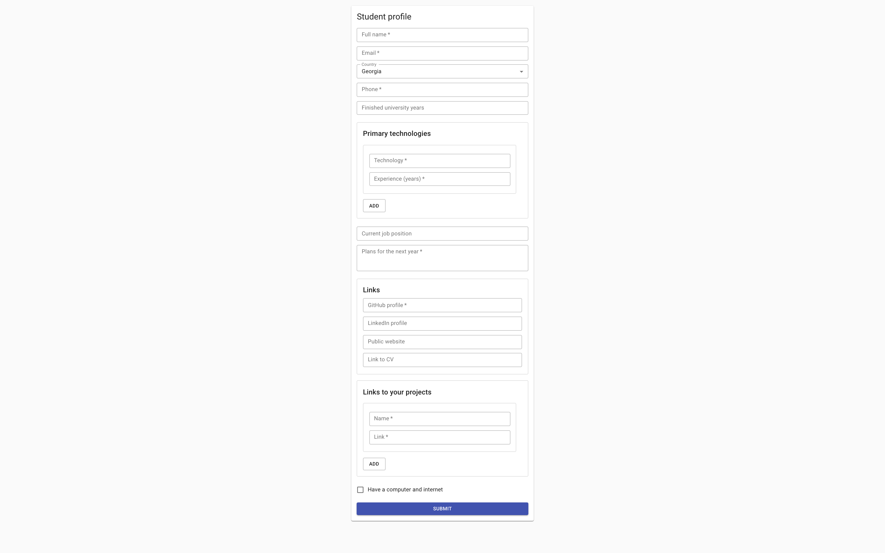
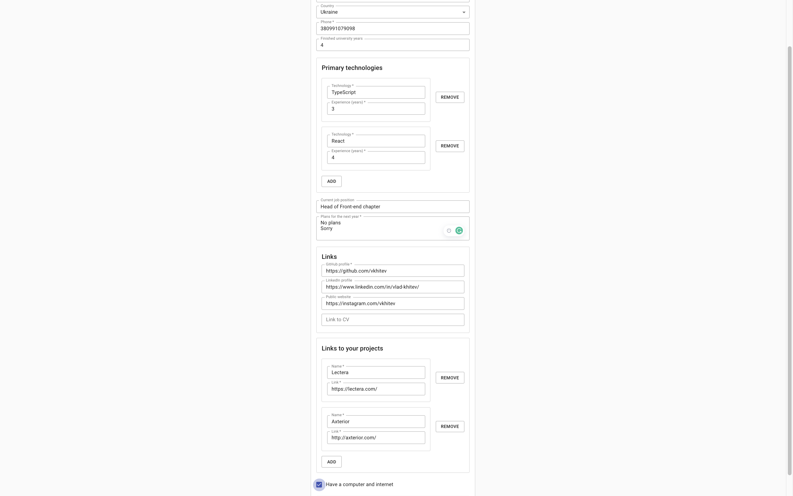
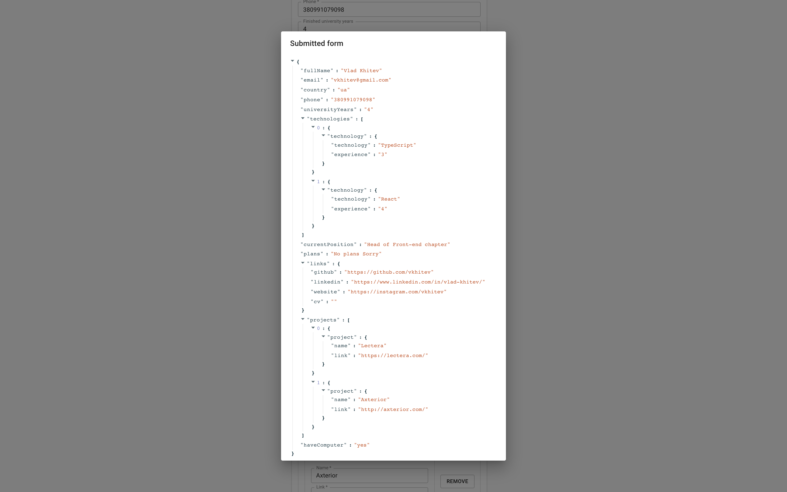

# Form builder

This repository contains the test task that covers multiple areas of development:
- Abstract thinking
- Working with HTML forms
- Working with the component framework (React, Angular, Vue)
- Working with Firebase database and hosting
- Working with UI component framework (like Material UI)

The goal of the task is to build a function (a component) that takes a JSON schema as input and produces an HTML form as output.

## Abstract

Almost every site on the web has forms. Some of them are small and independent, others are huge and complex. For some of them we can apply a built-in browser validation, for others we build custom validation rules. Some of them can be generated by a 3rd party tool, some require custom programming.

The ability to work with forms is an important skill. In this task we'll try to simplify the process of creating forms by introducing an abstraction. Please understand that the abstraction we'll create is incomplete and wrong. While simplifying the creation of simple form elements, it limits our capabilities in creating complex forms with dependent fields and custom elements.

As a result, you will have an application that renders a form described completely by the JSON schema and saves the submitted results in the database.

## Task

You need to implement a `FormBuilder` component that accepts two properties:
```ts
{
  schema: FormSchema
  onSubmit: (values: any) => void
}
```

This component should render the form described by the `schema` object, and a "Submit" button (see the screenshots below).

Once the form is attempted to be submitted, the built-in browser validation should trigger. In case of any errors in the form, the form shouldn't be submitted. You don't need to implement any custom validation or show custom errors. You need only the [built-in validation](https://developer.mozilla.org/en-US/docs/Learn/Forms/Form_validation).


The file where the major part of work should take place is `/src/lib/form-builder/form-builder.tsx`.

The form schema is defined in the `/src/lib/form-builder/types.ts` file.

After the component is implemented and the `onSubmit` function returns an object with values, you need to integrate with the [Firestore](https://firebase.google.com/docs/Firestore) and save the submitted object as a database record on every form submit.

The last step is to use [Firebase Hosting](https://firebase.google.com/products/hosting) to deploy the application.

## Screenshots of a finished solution (EXAMPLE)





## Output JSON after the `student-profile` form is submitted

```json
{
  "fullName": "Vlad Khitev",
  "email": "vkhitev@gmail.com",
  "country": "ua",
  "phone": "380991079098",
  "universityYears": "4",
  "technologies": [
    {
      "technology": {
        "technology": "TypeScript",
        "experience": "3"
      }
    },
    {
      "technology": {
        "technology": "React",
        "experience": "4"
      }
    }
  ],
  "currentPosition": "Head of Front-end chapter",
  "plans": "No plans Sorry",
  "links": {
    "github": "https://github.com/vkhitev",
    "linkedin": "https://www.linkedin.com/in/vlad-khitev/",
    "website": "https://instagram.com/vkhitev",
    "cv": ""
  },
  "projects": [
    {
      "project": {
        "name": "Lectera",
        "link": "https://lectera.com/"
      }
    },
    {
      "technology": {
        "name": "Axterior",
        "link": "http://axterior.com/"
      }
    }
  ],
  "haveComputer": "yes"
}
```

## Q&A

### How to start?

1. Fork this repository.
2. Clone the fork and work with it.
3. Use Git to create commits (following the https://www.conventionalcommits.org/) and push them to your repository.
4. In case of any questions, DM Vlad Khitev in WhatsApp.
5. When the task is done, DM Vlad Khitev.

### Can I use my favorite framework instead of React?

Yes. Allowed frameworks are: React, Angular, Vue.

However, I would say that implementing this task with React should be easier than with other frameworks, especially, Angular.

### What if I don't know any of these frameworks?

You have two options. Either it's a good time to start learning them (React is preferred), or you can accomplish the task in vanilla JS (without using any frameworks). The first option is preferred.

### Do you have a non-React starter project?

No. Feel free to remove all the React-related code and install your favorite framework.

### What do I need to know to accomplish the task?

- Basic programming concepts: conditions, loops, variables, functions, recursion.
- Basic data structures: objects, arrays.
- HTML forms and validations.
- State management approach in the preferred framework.
- Firebase Firestore and hosting.
- Ability to read TypeScript types.
- Ability to use NPM in case you need to install a package.

### I do not know TypeScript

TypeScript is used here only as a live documentation. I defined the `FormSchema` and the `FormBuilder` property types for you. Read the `FormSchema` and see how the instance of that type is created (`studentProfileSchema`).

You do not need to write any TypeScript code/types to accomplish the task. Even when you work in .ts/.tsx files, you still can write any JavaScript there and ignore the type mismatch errors.

### Do I need to care about the maximum call stack in recursion?

Let's assume that the maximum array/object nesting is 5 levels. However, it would be great if you add a restriction that the form cannot contain more than 5 levels of nested objects.

###  Can I install helper libraries from NPM?

Yes.

### If using React, should I use controlled or uncontrolled components?

It's your responsibility to discover which types of components are better suited for this task.

### If using React, can I use `react-hook-form` or `formik` for the state management?

You can use any library on NPM you want.

### Should I use Material UI?

You can use any UI library you want. For example, Bootstrap is OK as well.

### Can I modify the project config?

Please do not modify the following files:

- .vscode/settings.json
- .editorconfig
- .env
- .gitignore
- .nvmrc
- tsconfig.json
- package.json / "eslintConfig"
- src/setupTests.ts
- src/react-app-env.d.ts
- src/index.tsx

## Recommendations

- Do not try to do the whole task at once. Decompose it into smaller tasks:
  - Create a dumb form with hardcoded attributes. Ignore the scheme at this stage.
    - Start with simple (leaf) elements like string and numeric inputs.
    - Finish with complex elements: arrays and objects.
  - Make sure you can collect all the form data and send it to the `onSubmit` callback.
  - Then you can start replacing the hardcoded attributes with the schema.
  - Connecting to the database and hosting should be the last steps.
- Feel free to mark all fields as optional during the development phase to be able to submit the form without filling all the fields every time.
- Remember that the schema is recursive. The object can be nested in the object up to 5 times (artificial limitation).

## Acceptance criteria

- The `FormBuilder` component renders a form for *any valid* `schema` with the maximum nesting depth of 5.
- Each time the form is submitted, the values are saved to the Firestore.
- The website is hosted by the Firebase Hosting service.
- The form is user-friendly and accessible enough.
- The output JSON is not flat: it contains primitive types as well as objects and arrays.

## Rules (IMPORTANT)

Highest importance:
- If any kind of **plagiarism** will be detected, both original and copied works **won't be reviewed**. By plagiarism we mean stealing the code of your colleagues. Finding information in Google or StackOverflow is **allowed**!

Medium importance:
- Use Node.js version specified in `.nvmrc` file.
- Use `npm@7.x.x`. It comes automatically with the most recent version of Node.js.
- Use [VSCode](https://code.visualstudio.com/) as a code editor. Install the following extensions:
  - [EditorConfig](https://marketplace.visualstudio.com/items?itemName=EditorConfig.EditorConfig)
  - [ESLint](https://marketplace.visualstudio.com/items?itemName=dbaeumer.vscode-eslint)
- Follow [Conventional Commits](https://www.conventionalcommits.org/) when working with Git.
- All tests must be passed (even if it's one test).

## Available Scripts

This project was bootstrapped with [Create React App](https://github.com/facebook/create-react-app).

In the project directory, you can run:

### `npm start`

Runs the app in the development mode.\
Open [http://localhost:3000](http://localhost:3000) to view it in the browser.

The page will reload if you make edits.\
You will also see any lint errors in the console.

### `npm test`

Launches the test runner in the interactive watch mode.\
See the section about [running tests](https://facebook.github.io/create-react-app/docs/running-tests) for more information.

### `npm run build`

Builds the app for production to the `build` folder.\
It correctly bundles React in production mode and optimizes the build for the best performance.

The build is minified and the filenames include the hashes.\
Your app is ready to be deployed!

See the section about [deployment](https://facebook.github.io/create-react-app/docs/deployment) for more information.

## Learn More

You can learn more in the [Create React App documentation](https://facebook.github.io/create-react-app/docs/getting-started).

To learn React, check out the [React documentation](https://reactjs.org/).
